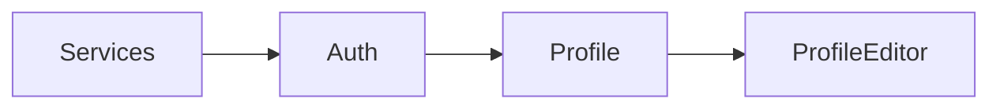

# T5-17 — Hook Dependency Graph

> Mục tiêu: Lập **đồ thị phụ thuộc** giữa hooks để kiểm soát **thứ tự**, tránh **vòng lặp**, tối ưu biên giới re-render, và hỗ trợ refactor quy mô lớn.

---

## 1) Vì sao cần đồ thị?
- Dự án lớn có nhiều hook **gọi chéo** nhau → khó thấy ảnh hưởng.  
- Graph giúp nhận diện **điểm nóng** & **cycles** (hook A phụ thuộc B, B phụ thuộc A).

---

## 2) Phân loại cạnh phụ thuộc
- **Data → Data**: `useProfile` phụ thuộc `useAuth` (lấy `user.id`).  
- **Data → UI**: `useProfile` ảnh hưởng `useDisclosure` (mở khi cập nhật).  
- **Infra**: hooks phụ thuộc **services** (API, storage) qua DI/Context.

---

## 3) Quy tắc thiết kế
- **Một chiều** từ **tầng thấp → cao** (infra → domain → UI).  
- Hook ở tầng dưới **không** import hook tầng trên.  
- Tránh chia sẻ **mutable** state ngoài contract.

---

## 4) Vẽ graph tối thiểu
```
useServices ──► useAuth ──► useProfile ─┬─► useProfileEditor
                                        └─► useActivity
```
- Mũi tên biểu thị **đọc**/**gọi**.
- Biên giới re-render: nơi **object/hàm** đổi tham chiếu.

---

## 5) Kiểm tra cycle
- Dấu hiệu: import vòng, state đổi gây loop.  
- Công cụ: **madge** để phát hiện cycle giữa file/module.

```bash
npx madge src/hooks --circular
```

---

## 6) Ổn định biên giới
- Các API hook bậc cao trả object **memo**; chỉ thay đổi khi **thực sự khác**.
- Dùng `useStableCallback`/`useLatest` cho handler dài hạn.

---

## 7) Tài liệu hoá đồ thị
- Tạo `HOOKS.md` liệt kê: **input**, **output**, **deps** của từng hook.  
- Đính kèm sơ đồ Mermaid cho CI review.

```md

```

---

## 8) Checklist
- [ ] Đồ thị một chiều: infra → domain → UI.
- [ ] Không import ngược; tránh cycles (madge).
- [ ] Memo hoá biên giới; callback ổn định.
- [ ] Ghi tài liệu HOOKS.md + sơ đồ.